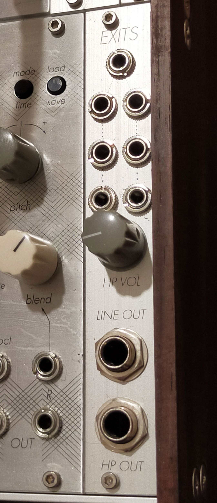

# Exits

4hp DIY eurorack line and headphone output module based on the [Nearness](https://github.com/sarnesjo/nearness) and [Forestcaver headphone amp](https://github.com/forestcaver/Analog-Voice/tree/master/AJH_Headphone_Amp) designs

The Nearness section is a "minimal panning mixer for the Eurorack modular synthesizer system. Seven inputs, two outputs. The closer an input is to an output, the greater its influence on it."  
The Forestcaver headphone amp is a "NJM4556 based headphone amp. This is essentially the power section from the nwavguy o2 headphone amp. It has a very low output impedance (~1 ohm) so can drive even low impedance headphones. It can deliver a high power (utilising two sections of the njm4556 per channel) so can drive 600 ohm impedance headphones with no problem. There is a high pass filter on the input to block dc."

These have been combined in a single 4hp module which utilises 6.35mm stereo jacks for both the line and headphone outputs.  

## Schematic and PCBs

The [kicad](kicad) directory contains the schematic and PCB layout as a KiCad 6 project.

## Panel

Pending (I need to adjust the potentiometer placement and output jack placement due to board revisions)

## Revisions and notes 

This version is an updated version of my original prototype.  Notable changes as follows:
- Updated pin header widths to improve security/stability between the two boards.
- Changed the type of jacks used for the output to a more widely-available device, the SJ-63083A.
- Adjusted positioning of the potentiometer to provide more space between the shaft and the nearest input jacks.
- Reversed the headphone and line output jacks to the more logical orientation; headphone jack is nearest the headphone volume knob
### Please not that these changes, while minor, have not been tested, so build at your own risk.

## License

[CC BY-SA 4.0](http://creativecommons.org/licenses/by-sa/4.0/)
